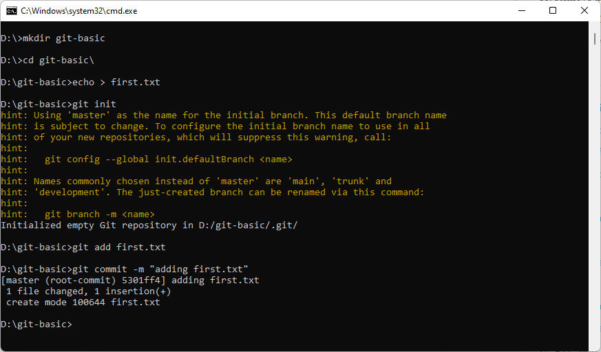
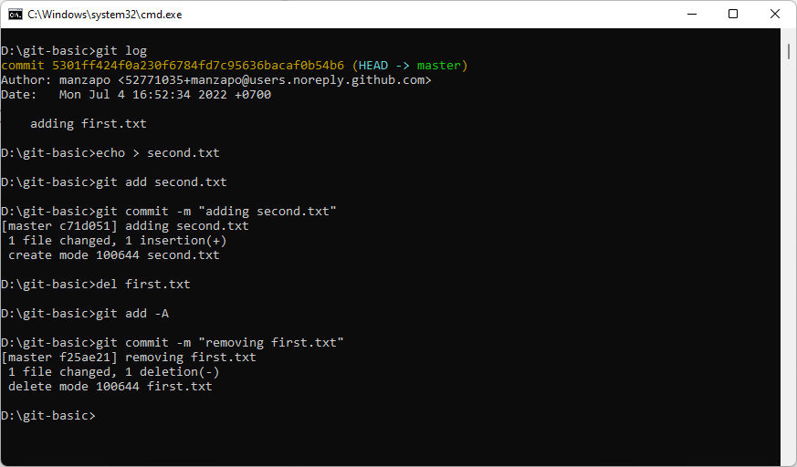
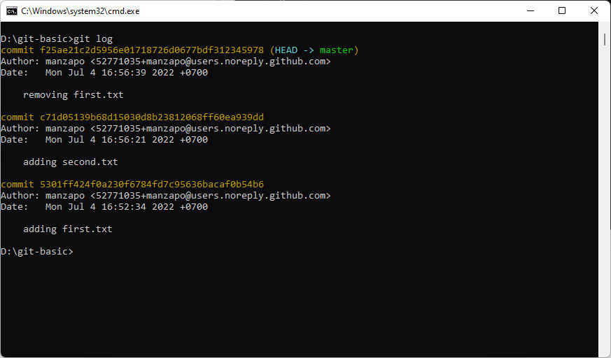

## Specs
Now that you have learned the basics of Git workflow, try running through this a couple of times on your own:

1. Create a folder called `git-basic`
2. `cd` into the `git-basic` folder
3. Create a file called `first.txt`
4. Initialize an empty git repository
5. Add `first.txt` to the staging area
6. Commit with the message "adding first.txt"
7. Check out your commit with `git log`
8. Create another file called `second.txt`
9. Add `second.txt` to the staging area
10. Commit with the message "adding second.txt"
11. Remove the `first.txt` file
12. Add this change to the staging area
13. Commit with the message "removing first.txt"
14. Check out your commits using `git log`

## Jawaban

|  |
|:--:| 
| *command 1 - 6* |

1. `mkdir git-basic`
2. `cd git-basic\`
3. `echo > first.txt`
4. `git init`
5. `git add first.txt`
6. `git commit -m "adding first.txt"`

|  |
|:--:| 
| *command 7 - 13* |

7. `git log`
8. `echo > second.txt`
9. `git add second.txt`
10. `git commit -m "adding second.txt"`
11. `del first.txt`
12. `git add -A`
13. `git commit -m "removing first.txt"`

|  |
|:--:| 
| *command 14* |

14. `git log`