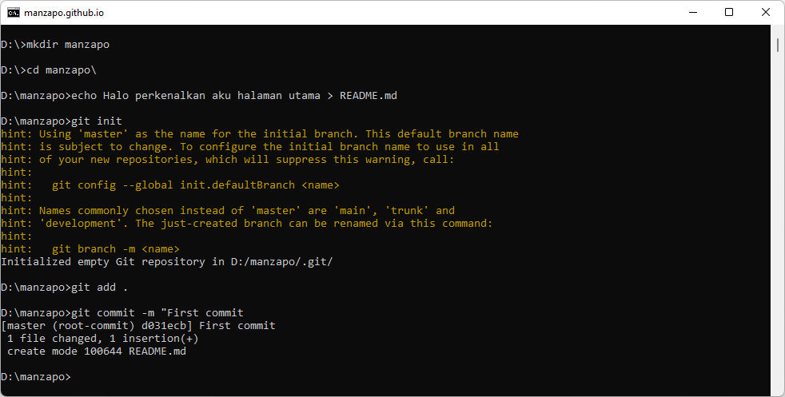
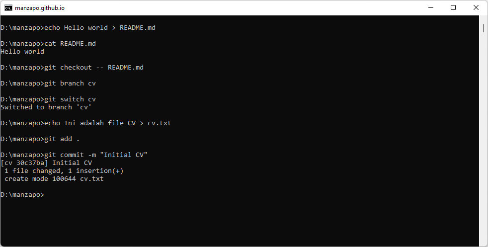
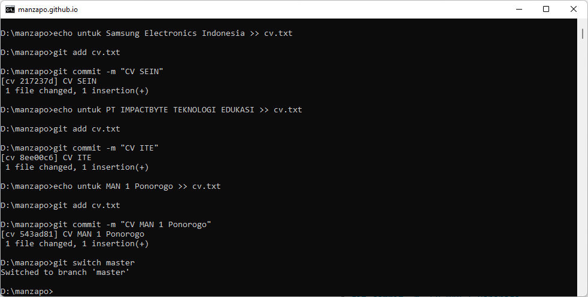
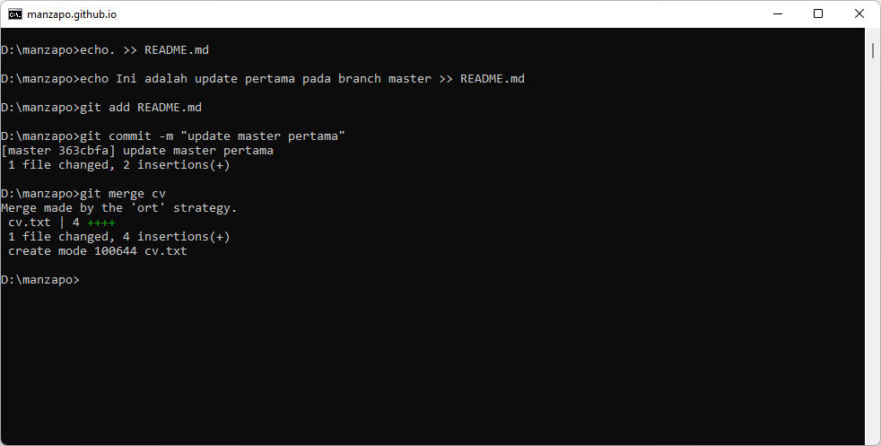
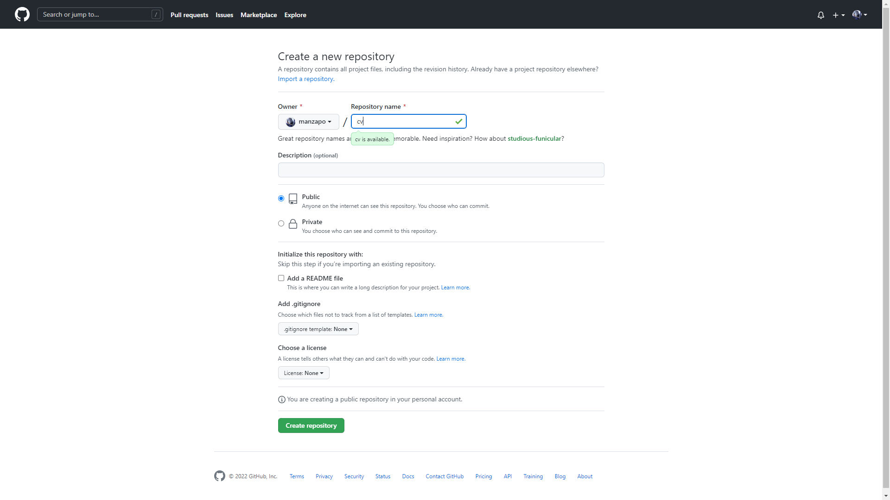
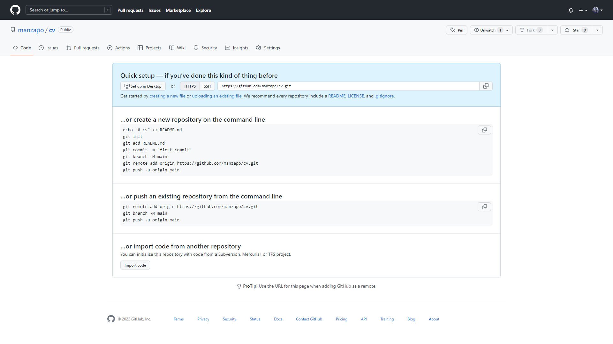
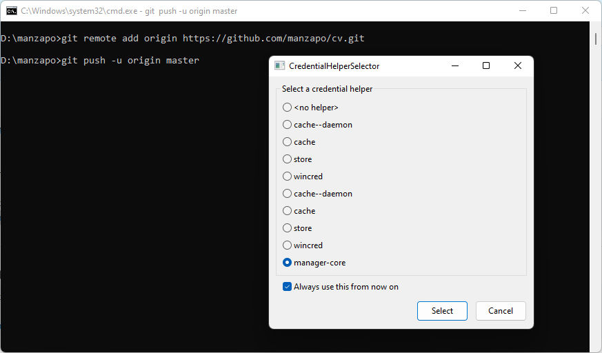
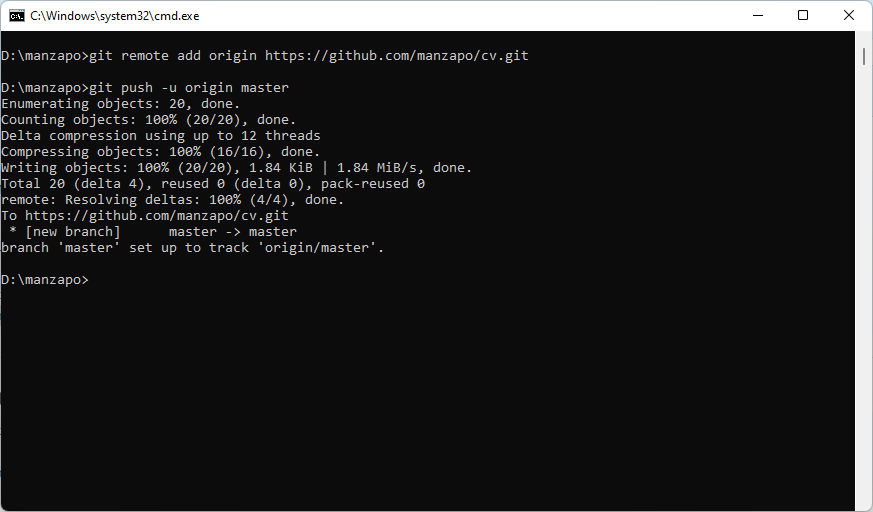
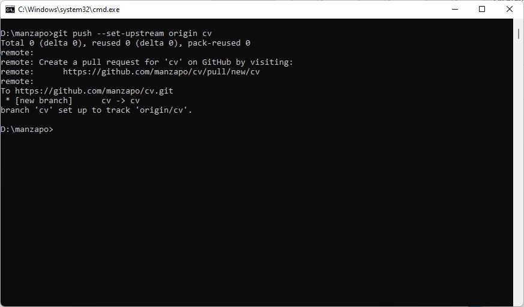
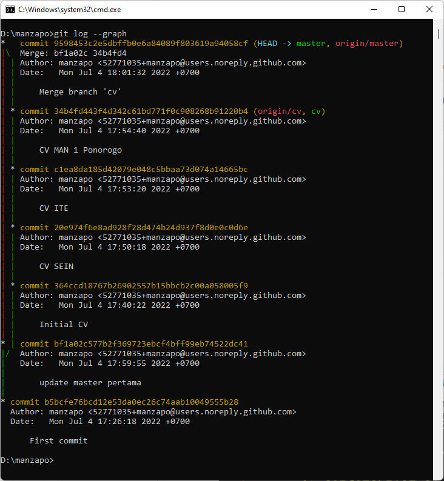

## Specs

Kamu adalah seorang programer yang ingin mendaftar kesalah satu perusahaan terkenal, oleh karena itu kamu sudah memulai untuk mempersiapkan `CV` dan `Portfolio`. Namun kamu tidak ingin membuat banyak `CV` dan `Portfolio` dengan model seperti ini
- `cv.pdf`
- `cv-final.pdf`
- `cv-final-v2.pdf`

Oleh karenanya kamu berinisiatif untuk menggunakan Git, lalu langkah yang kamu lakukan adalah:
1. membuat sebuah folder kosong dengan **namamu sendiri**
2. membuat sebuah file di dalam folder tersebut dengan nama `README.md`, isi file tersebut dengan kalimat<br>`"Halo perkenalkan aku halaman utama"`
3. **inisialisasi** folder tersebut dengan Git, kemudian simpan perubahan menggunakan `commit` dengan pesan<br>`"First commit"`
4. Ganti teks sebelumnya dengan `"Hello world"
5. Tampilkan isi teks tersebut pada command line menggunakan command `cat`
6. Ternyata kamu tidak ingin perubahan tersebut, dan ingin kembali ke perubahan seperti commit yang terakhir. Lakukan teknik git backtracking untuk mengembalikan ke perubahan commit yang terakhir.
7. buat `branch` baru dengan nama `cv`, hal ini berguna agar histori kita tidak tercampur
8. pindah `branch` ke dalam `cv`, kemudian buat file dengan nama `cv.txt` dan isi file tersebut dengan kalimat:<br>`"Ini adalah file CV"`
9. kemudian simpan perubahan menggunakan `commit` dengan pesan<br>`"Initial CV"`
10. tambahkan **3 perusahaan** yang akan kamu lamar, dan setiap menuliskan 1 nama perusahaan kamu harus melakukan dokumentasi dan menyimpan perubahan menggunakan `commit`
11. kembali ke `branch master`
12. ubah file `README.md` menjadi
    ```
    Halo perkenalkan aku halaman utama

    Ini adalah update pertama pada branch master
    ```
    jangan lupa untuk menyimpan perubahan menggunakan `commit` dengan pesan<br>`"update master pertama"`
13. gabungkan branch `cv` ke dalam branch `master` menggunakan perintah `git merge`
14. unggah Git Repository project tersebut tersebut ke dalam GitHub

## Jawaban

|  |
|:--:| 
| *command 1 - 3* |

1. `mkdir manzapo`
2. `echo Halo perkenalkan aku halaman utama > README.md`
3. - `git init`
   - `git add .`
   - `git commit -m "First commit"`

|  |
|:--:| 
| *command 4 - 9* |

4. `echo Hello world > README.md`
5. `cat README.md`
6. `git checkout -- README.md`
7. `git branch cv`
8. - `git switch cv`
   - `echo Ini adalah file CV > cv.txt`
9. - `git add .`
   - `git commit -m "Initial CV"`

|  |
|:--:| 
| *command 10 - 11* |

10. - `echo untuk Samsung Electronics Indonesia >> cv.txt`
    - `git add cv.txt`
    - `git commit -m "CV SEIN"`
    - `echo untuk PT IMPACTBYTE TEKNOLOGI EDUKASI >> cv.txt`
    - `git add cv.txt`
    - `git commit -m "CV ITE"`
    - `echo untuk MAN 1 Ponorogo >> cv.txt`
    - `git add cv.txt`
    - `git commit -m "CV MAN 1 Ponorogo"`
11. `git switch master`

|  |
|:--:| 
| *command 12 - 13* |

12. - `echo. >> README.md`
    - `echo Ini adalah update pertama pada branch master >> README.md`
    - `git add README.md`
    - `git commit -m "update master pertama"`
13. `git merge cv`

14. [Github Repository "cv"](https://github.com/manzapo/cv)

|  |
|:--:| 
| Membuat repository Github |

|  |
|:--:| 
| Repository berhasil dibuat |

|  |
|:--:| 
| Autentikasi |

|  |
|:--:| 
| Upload branch master |

`git push --set-upstream origin master`

|  |
|:--:| 
| Upload branch cv |

`git push --set-upstream origin cv`


## Expected Result

|  |
|:--:| 
| grafik pekerjaan |

`git log --graph`