# Submit my changes

1. Fork `https://github.com/impactbyte/tech4impact-students-bio.git`
   | 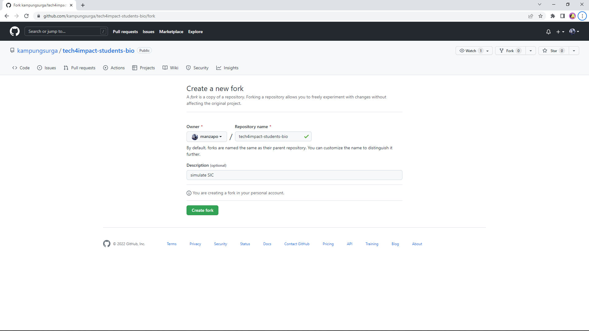 |
   |:--:|
   | Create a new fork |

   | 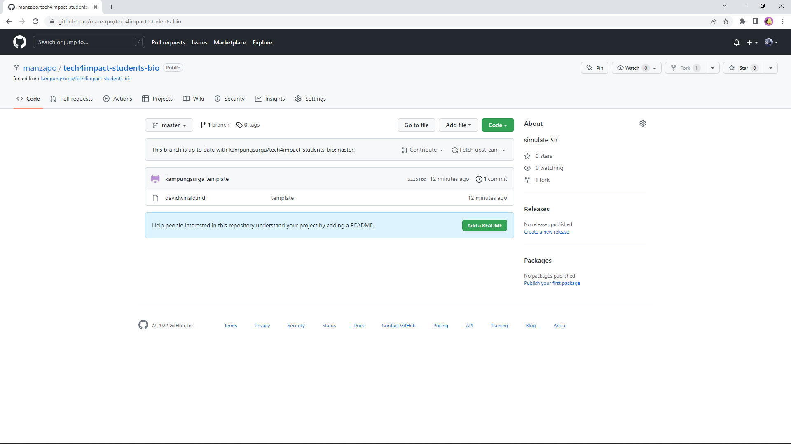 |
   |:--:|
   | Hasil fork repository |

2. `git clone https://github.com/manzapo/tech4impact-students-bio.git .`

   | 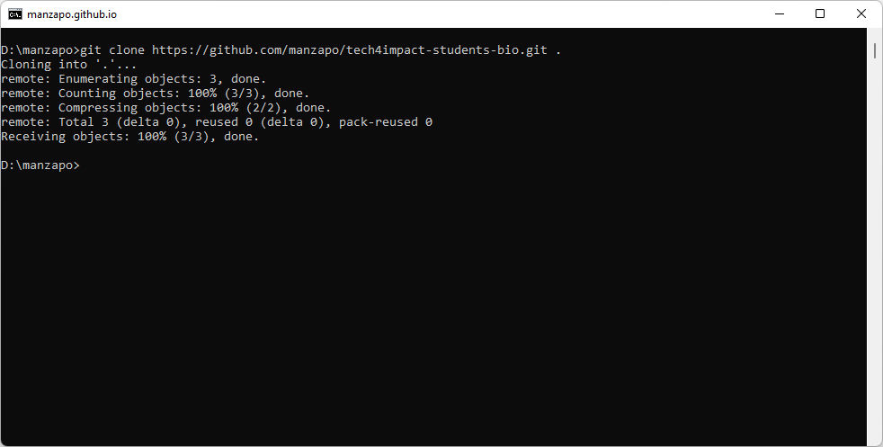 |
   |:--:|
   | Clone remote repository |

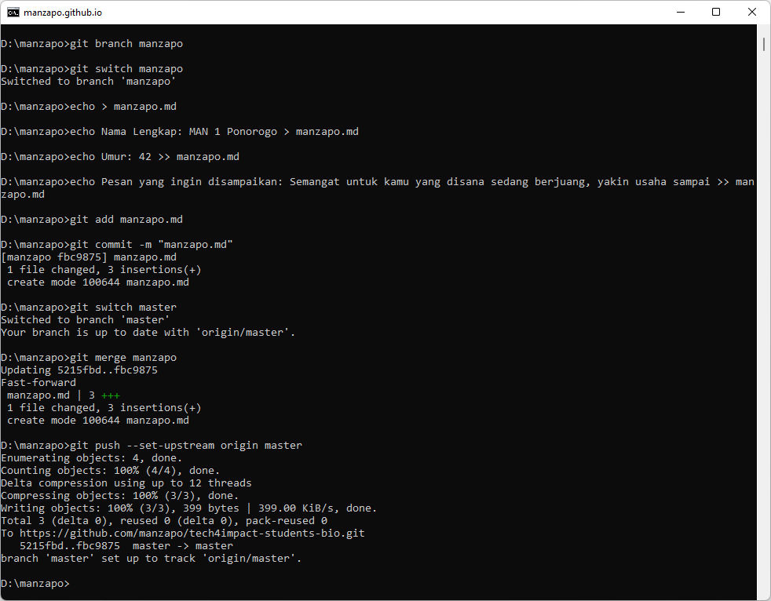

3. `git branch manzapo`
4. `git switch manzapo`
5. `echo > manzapo.md`
6. - `echo > manzapo.md`
   - `echo Nama Lengkap: MAN 1 Ponorogo > manzapo.md`
   - `echo Umur: 42 >> manzapo.md`
   - `echo Pesan yang ingin disampaikan: Semangat untuk kamu yang disana sedang berjuang, yakin usaha sampai >> manzapo.md`
7. `git add manzapo.md`
8. `git commit -m "manzapo.md"`
9. `git merge master`
10. - `git switch master`
    - `git push --set-upstream origin master`

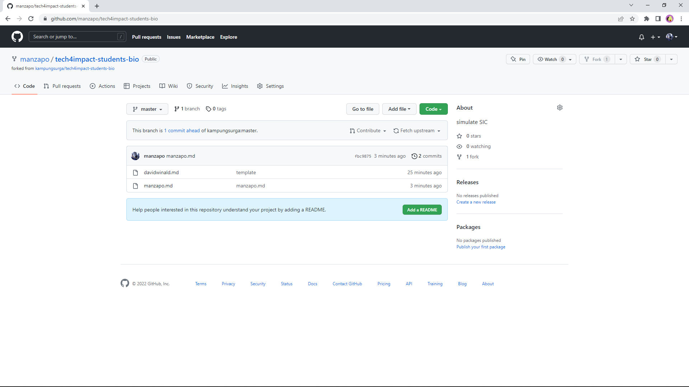
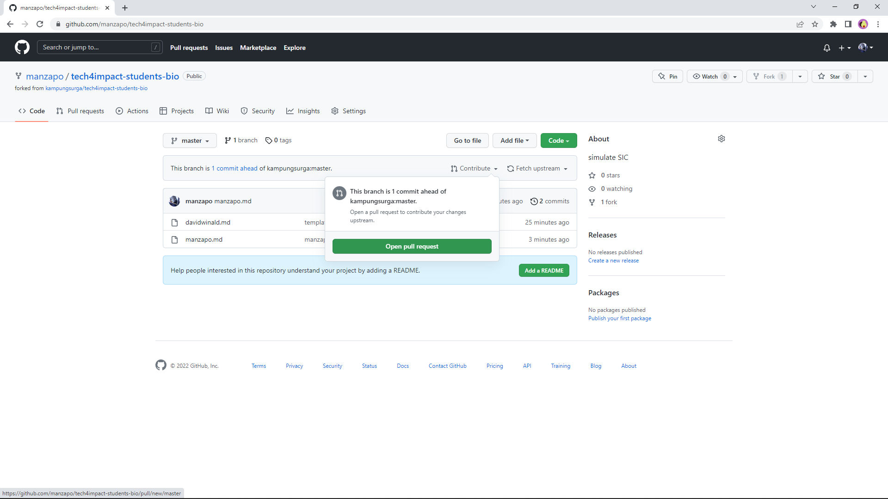
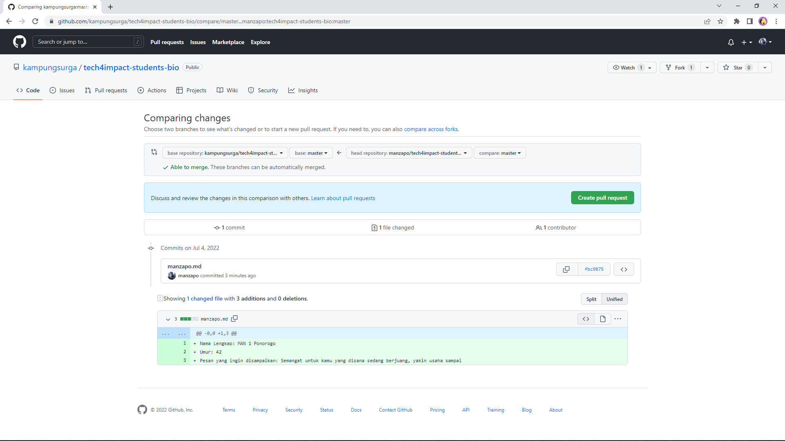
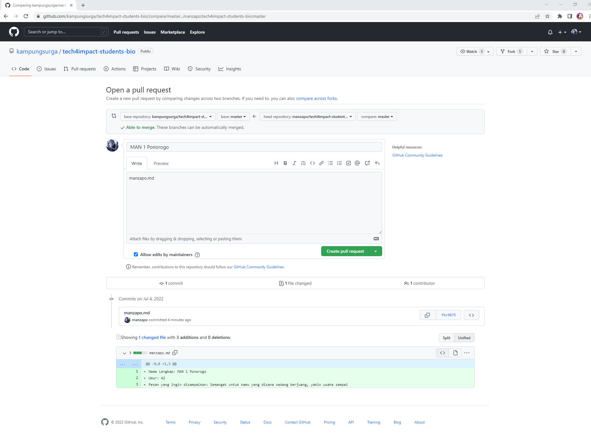
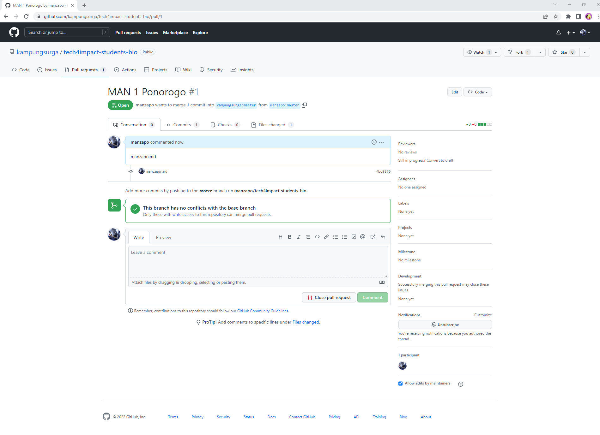
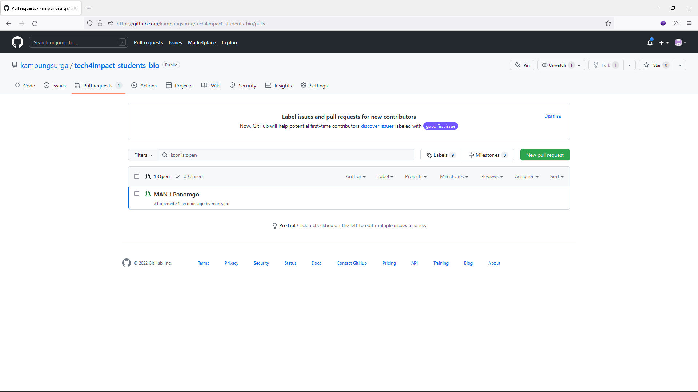
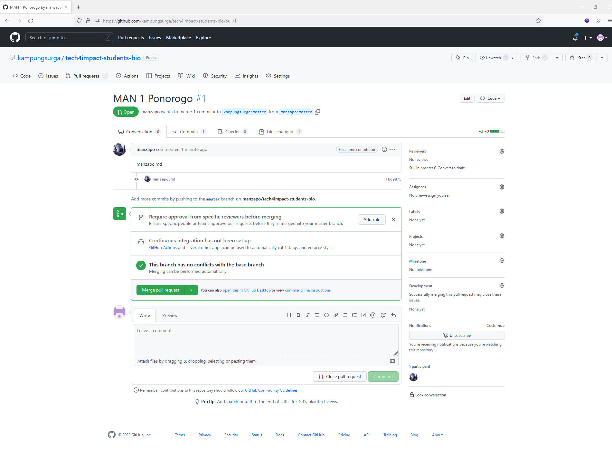
